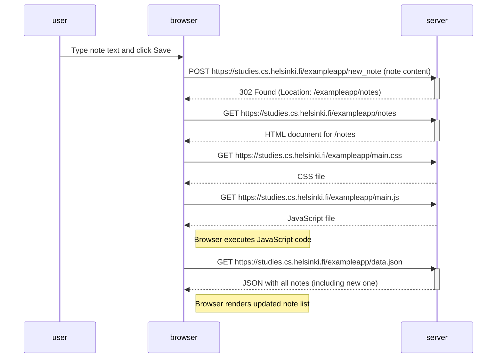

```mermaid
sequenceDiagram
    participant user
    participant browser
    participant server

    user->>browser: Type note text and click Save

    browser->>server: POST https://studies.cs.helsinki.fi/exampleapp/new_note (note content)
    activate server
    server-->>browser: 302 Found (Location: /exampleapp/notes)
    deactivate server

    browser->>server: GET https://studies.cs.helsinki.fi/exampleapp/notes
    activate server
    server-->>browser: HTML document for /notes
    deactivate server

    browser->>server: GET https://studies.cs.helsinki.fi/exampleapp/main.css
    server-->>browser: CSS file

    browser->>server: GET https://studies.cs.helsinki.fi/exampleapp/main.js
    server-->>browser: JavaScript file

    Note right of browser: Browser executes JavaScript code

    browser->>server: GET https://studies.cs.helsinki.fi/exampleapp/data.json
    activate server
    server-->>browser: JSON with all notes (including new one)
    deactivate server

    Note right of browser: Browser renders updated note list
```

